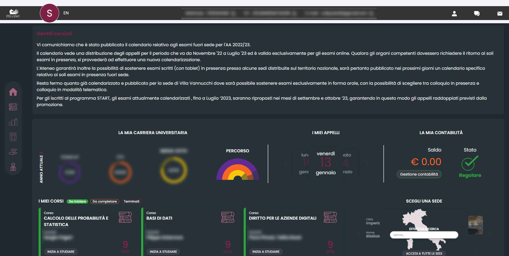

# Pegaso University - Dark Theme

This is a .css stylesheet for who, like me, hate white pages.
Add the style into extensions that can inject .css in page (e.g. Stylus) et voiltà!
You're in!

The following screenshot it's and example of the dark-theme:

It's still work in progress.
NB. I'm not a FE developer so, probably, it's the worst things you'll ever see on Github but... It works for now.
Feel free to fork/create PR in order to improve the style.

Cheers,
Simone
